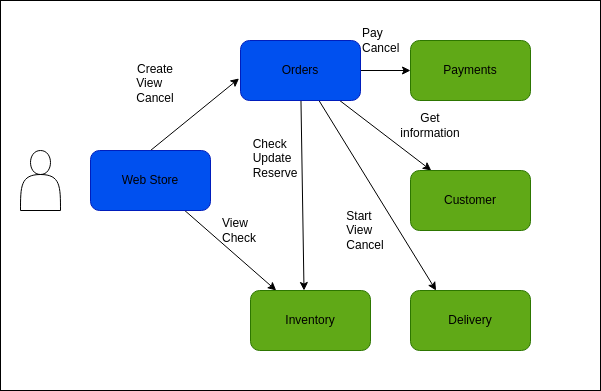

<!-- Improved compatibility of back to top link: See: https://github.com/othneildrew/Best-README-Template/pull/73 -->
<a name="readme-top"></a>
<!--
*** Thanks for checking out the Best-README-Template. If you have a suggestion
*** that would make this better, please fork the repo and create a pull request
*** or simply open an issue with the tag "enhancement".
*** Don't forget to give the project a star!
*** Thanks again! Now go create something AMAZING! :D
-->


<!-- PROJECT SHIELDS -->
<!--
*** I'm using markdown "reference style" links for readability.
*** Reference links are enclosed in brackets [ ] instead of parentheses ( ).
*** See the bottom of this document for the declaration of the reference variables
*** for contributors-url, forks-url, etc. This is an optional, concise syntax you may use.
*** https://www.markdownguide.org/basic-syntax/#reference-style-links
-->
[![Contributors][contributors-shield]][contributors-url]
[![Forks][forks-shield]][forks-url]
[![Stargazers][stars-shield]][stars-url]
[![Issues][issues-shield]][issues-url]
[![MIT License][license-shield]][license-url]
[![LinkedIn][linkedin-shield]][linkedin-url]


<!-- PROJECT LOGO -->
<br />
<div align="center">
  <a href="https://github.com/mikelm2020/sam-events-advanced">
    
  </a>

  <h3 align="center">Serverless Ecommerce project with Amazon EventBridge</h3>

  <p align="center">
    An application with many microservices for simulate an ecommerce platform using AWS SAM, that uses Amazon EventBridge as custom bus and central logging of events.
  </p>
</div>


<!-- TABLE OF CONTENTS -->
<details>
  <summary>Table of Contents</summary>
  <ol>
    <li>
      <a href="#about-the-project">About The Project</a>
      <ul>
        <li><a href="#built-with">Built With</a></li>
      </ul>
    </li>
    <li><a href="#contact">Contact</a></li>
    <li><a href="#acknowledgments">Acknowledgments</a></li>
  </ol>
</details>


<!-- ABOUT THE PROJECT -->
## About The Project

This project is a demo application of an ecommerce platform with the followings microservices:
* customer .- customer information such as name, address, and email
* order .- service to create an order orchestrating all other services
* inventory .- service to store inventory information of items to sell
* payment .- service to make and cancel payments, it can randomly fail
* delivery .- service to estimate distance and cost of a delivery, and to start, complete or cancel a delivery

This project is build with a event-driven architecture, in the next table swhow the events take part:
[events table](event-table.md).

## Detail information for each service

### Inventory service

#### InventoryTable content

Look at the **Items** of the `InventoryTable` in the [DynamoDB console](https://console.aws.amazon.com/dynamodb). The actual name of the table will be in the form `<stack-name>-InventoryTable-<unique-ID>`. Note that the table is empty before the first order is created.

If the order was created successfully, you should have an item with status `DELIVERING`.

### Payments service

#### Payment successful

In case you find the PaymentMade event, the next events are:

- ItemRemoved (from the Inventory service)
- DeliveryStarted (from the Delivery Service)

#### Payment failed

To force a failed payment, you can increase the value of the `PAYMENT_FAIL_PROBABILITY` environment variable in the configuration of the `PaymentFunction` (for example, to `0.9` or `1.0`). You can change the value directly in the Lambda console or in the SAM template (and deploy).

In case you find the `PaymentFailed` event, the next events are:

- `ItemUnreserved` (from the Inventory service)

In the `InventoryTable`, the order has status `PAYMENT_FAILED`.

### Delivery service

#### Completing order delivery

To move forward when a delivery starts, you need to send an event to report if the delivery has been successful (`Delivered`) or not (`DeliveryCancel`).

In the [EventBridge console](https://console.aws.amazon.com/events/), choose **Event buses** and then the `AppEventBus-<stack-name>` custom event bus. Then, choose **Send events**:

- In **Event source**, you can put anything you want (for exmaple, `Logistics`)

- In **Detail type**, you should put either `Delivered` or `DeliveryCanceled`

- In **Event detail**, you need to put a JSON object identifying the order in the format (see the `deliveryEvent.json` file in the `data` directory):

```json
{
  "customerId": "customer-1",
  "orderId": "..."
}
```

After you **Send** the event, new events will appear.

##### Delivered order

If you send the `Delivered` event, these are the new events in the logs:

- `Delivered` (the event you sent form the EventBridge console)
- `DeliveryWasDelivered` (from the Delivery service)
- `OrderDelivered` (from the Order service)

In the `InventoryTable`, the order has status `DELIVERED`.

#### Delivery canceled

If you send the `DeliveryCanceled` event, these are the new events in the logs:

- `DeliveryCanceled` (the event you sent form the EventBridge console)
- `DeliveryWasCanceled` (from the Delivery service)
- `OrderCanceled` (from the Order service)
- `ItemReturned` (from the Inventory service)
- `PaymentCanceled` (from the Payment service)

### Event Store / Event Sourcing - Central logging of events

The `EventStoreFunction` is storing all events in CloudWatch Logs and in the `EventStoreTable` in DynamoDB.

The `EventStoreTable` has a primary ket composed by:

- `who` : `C#<customerId>` – In this way, you can quickly get all info for a customer. Events not related to a customer will use a different initial letter. For example, product updated can set this to `P#<productId>`
- `timeWhat` : `timestamp#eventType`
- `eventSource` : the source of the event
- `eventDetail` : the full JSON of the event as a string

#### EventStoreFunction logs

Look at the logs of the `EventStoreFunction` Lambda function. The actual name of the function will be in the form `<stack-name>-EventStoreFunction-<unique-ID>`. To find the logs, in the [Lambda console](https://console.aws.amazon.com/lambda/), select the function, then the **Monitor** tab, then choose **View logs in CloudWatch**. Note that there are no logs before the first execution of a function.

Close the left pad and choose **View as text**. You can see all the event published by different services processing the order. Now there is only an order. When there are more than one order in the logs, you can filter by `orderId`, for example `"2021-09-29T16:50:20.784Z"`, including the double quotes at the start and at the end.

In order, the events for the order you created are:

- `OrderCreated` (from the Order service)
- `ItemReserved` (from the Inventory service)
- `ItemDescribed` (from the Inventory service)
- `CustomerDescribed` (from the Customer service)
- `DeliveryEstimated` (from the Delivery service)
- `PaymentMade` or `PaymentFailed` (from the Payment service)

The Payment service fails with a probability passed to the Lambda `PaymentFunction` in an environment variable (`PAYMENT_FAIL_PROBABILITY`) that by default has value `0.2` (20% probability to fail). You can edit the variable in the Lambda console.

## Architecture



<p align="right">(<a href="#readme-top">back to top</a>)</p>

## Deploy the project

To trigger the create order flow, use this url:

```
GET /order/create/{customerId}/{itemId} #
```
### Requirements

- AWS CLI already configured with Administrator permission
- AWS SAM CLI installed - minimum version 1.37.0 (sam --version)
- Pyhton 3.9 installed

### Deploy this demo

Start by building and deploying the project. We will be using [AWS SAM](https://docs.aws.amazon.com/serverless-application-model/latest/developerguide/serverless-sam-cli-install.html) and make sure you are running the latest version - at the time of writing, this was 1.78.0 (sam --version):

```bash
sam build -p # Parallel build

sam deploy -g # Guided deployments
```

When deploying for the first time you will need to input an URL. This URL simulates the third party delivery service. For faking this URL you can use the site [Webhook.site](https://webhook.site/). If you want to see the Dead Letter queue in action, you need to input an URL that returns an error (or a non existant URL).

Next times, when you update the code, you can build and deploy with:

```bash
sam build -c -p && sam deploy # Parallel build caching previous builds
```

When asked about functions that may not have authorization defined, answer (y)es. The access to those functions will be open to anyone, so keep the app deployed only for the time you need this demo running. To delete the app:

```bash
sam delete
```

### Prepare the service

Load the sample data in the `data` directory, use the same stack name you entered for `sam deploy`:

```bash
./load.sh <stack-name>
```

### Create your first order

Create an order for `customer-1` buing `item-1` calling the Create Order API:

```
curl -i <API Gateway URL>/order/create/customer-1/item-1
```

From the output of the command, write down the `customerId` and the `orderId`, they together identify a specific order.

### Built With

* [![Python][Python]][Python-url]
* [![AWS][AWS]][AWS-url]
* [![Visual Studio Code][Visual Studio Code]][Visual Studio Code-url]

## AWS Services
* Amazon EventBridge
* Amazon API Gateway
* AWS Lambda
* AWS SAM
* AWS SDK Python
* Amazon SQS
* Amazon DynamoDB
* Amazon CloudWatch
* Amazon Location Service


<p align="right">(<a href="#readme-top">back to top</a>)</p>

<!-- CONTACT -->
## Contact

Miguel Angel López Monroy - 
[![linkedin][linkedin]][linkedin-url]
[![Gmail-shield][Gmail-shield]][Gmail-url]
[![Twitter-shield][Twitter-shield]][Twitter-url]

<p align="right">(<a href="#readme-top">back to top</a>)</p>


<!-- ACKNOWLEDGMENTS -->
## Acknowledgments

My favorite resources used:

* [Python Documentation](https://docs.python.org/3.9/)
* [Blog Marcia Villalba](https://blog.marcia.dev/event-driven-applications)
* [AWS Documentation](https://docs.aws.amazon.com/es_es/index.html)


<p align="right">(<a href="#readme-top">back to top</a>)</p>


<!-- MARKDOWN LINKS & IMAGES -->
<!-- https://www.markdownguide.org/basic-syntax/#reference-style-links -->
[contributors-shield]: https://img.shields.io/github/contributors/mikelm2020/sam-events-advanced.svg?style=for-the-badge
[contributors-url]: https://github.com/mikelm2020/sam-events-advanced/graphs/contributors
[forks-shield]: https://img.shields.io/github/forks/mikelm2020/sam-events-advanced.svg?style=for-the-badge
[forks-url]: https://github.com/mikelm2020/sam-events-advanced/network/members
[stars-shield]: https://img.shields.io/github/stars/mikelm2020/sam-events-advanced.svg?style=for-the-badge
[stars-url]: https://github.com/mikelm2020/sam-events-advanced/stargazers
[issues-shield]: https://img.shields.io/github/issues/mikelm2020/sam-events-advanced.svg?style=for-the-badge
[issues-url]: https://github.com/mikelm2020/sam-events-advanced/issues
[license-shield]: https://img.shields.io/github/license/mikelm2020/sam-events-advanced.svg?style=for-the-badge
[license-url]: https://github.com/mikelm2020/sam-events-advanced/blob/master/LICENSE.txt
[linkedin-shield]: https://img.shields.io/badge/-LinkedIn-black.svg?style=for-the-badge&logo=linkedin&colorB=555

[linkedin]: https://img.shields.io/badge/-LinkedIn-black.svg?style=flat-square&logo=linkedin&colorB=555
[linkedin-url]: https://linkedin.com/in/miguellopezmdev
[Gmail-shield]: https://img.shields.io/badge/Gmail-D14836?style=flat-square&logo=gmail&logoColor=white
[Gmail-url]: mailto:miguel.lopezm.dev@gmail.com
[Twitter-shield]: https://img.shields.io/badge/Twitter-%231DA1F2.svg?style=flat-square&logo=Twitter&logoColor=white
[Twitter-url]: https://twitter.com/miguellopezmdev

<!--[product-screenshot]: https://github.com/mikelm2020/video-streaming/blob/82a8c694a418723faacf992c5dd76b6e328120f8/api_playlists.png -->
[Python]: https://img.shields.io/badge/python-3670A0?style=for-the-badge&logo=python&logoColor=ffdd54
[Python-url]: https://www.python.org/
[AWS]: https://img.shields.io/badge/AWS-%23FF9900.svg?style=for-the-badge&logo=amazon-aws&logoColor=white
[AWS-url]: https://docs.aws.amazon.com/es_es/index.html
[Blog-url]: https://blog.marcia.dev/event-driven-applications
[Visual Studio Code]: https://img.shields.io/badge/Visual%20Studio%20Code-0078d7.svg?style=for-the-badge&logo=visual-studio-code&logoColor=white
[Visual Studio Code-url]: https://code.visualstudio.com/
